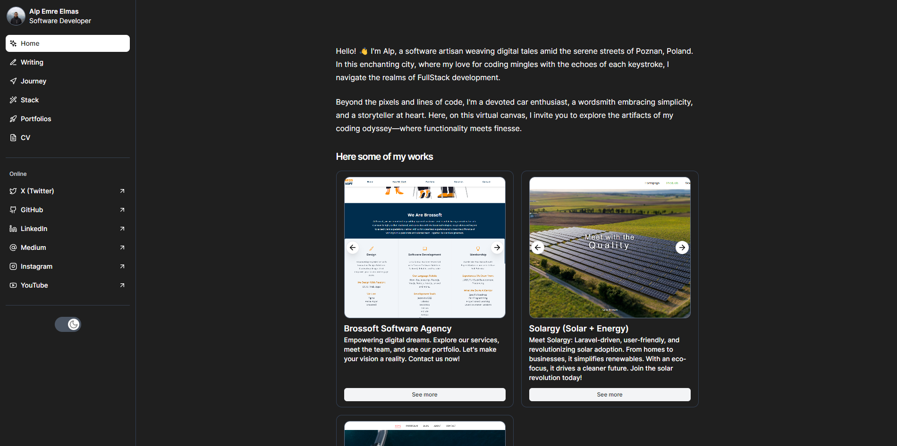

# Project Name

## Overview

This is my personal information and portfolio website written by Nextjs Tailwind.

## Table of Contents

- [Overview](#overview)
- [Motivation](#motivation)
- [Technologies Used](#technologies-used)
- [Features](#features)
- [Installation](#installation)
- [Roadmap](#roadmap)
- [ScreenShots](#screenshots)
- [Contributing](#contributing)
- [Contact](#contact)

## Motivation

I’d like to create a portfolio website that show my en

Welcome to my personal blog! My journey into the world of technology and software development has been driven by an insatiable curiosity and a passion for creating solutions that make a difference. Through this blog, I aim to share my experiences, insights, and the lessons I've learned along the way.

The motivation behind this blog stems from a desire to connect with like-minded individuals, to inspire and be inspired. I believe in the power of community and the importance of continuous learning. By documenting my projects, challenges, and successes, I hope to provide valuable content that can help others navigate their own paths in tech.

Whether you're a seasoned developer, a budding entrepreneur, or simply someone interested in the latest technological trends, my goal is to offer something for everyone. This blog is a platform for exchanging ideas, fostering creativity, and building a supportive network where we can all grow together.

Thank you for joining me on this journey. I look forward to sharing and learning with you!

Inspired by [onur.dev](http://onur.dev)

## Technologies Used

List the technologies, frameworks, and tools used in the project.

- Frontend: Nextjs, tailwind
- Backend: Contentful Graphql API
- DevOps: Vercel, GitHub Actions

## Features

✅ Articles of mine

✅ Journey of mine

✅ Stacks (projects that I used and like to use )

✅ Portfolios of mine

✅ My resume

✅ Social Media Links

✅ Dark Mode Feature

## Installation

Step-by-step instructions on how to set up the project locally.

```bash
# Clone the repository
git clone https://github.com/yourusername/yourproject.git

# Navigate to the project directory
cd yourproject

# Install dependencies
npm install

# Start the development server
npm start

```

## Roadmap

- [ ]  Popup for asking user to visit my github page
- [ ]  For first visit tutorial for the website

### Screenshots


## Contributing

Instructions on how to contribute to the project. Include guidelines for submitting issues, pull requests, and any code of conduct.

```markdown
1. Fork the repository
2. Create a new branch (`git checkout -b feature/yourfeature`)
3. Commit your changes (`git commit -m 'Add your feature'`)
4. Push to the branch (`git push origin feature/yourfeature`)
5. Open a pull request

```

## Contact

Provide your contact information for users who have questions or want to reach out.

- Email: [elmasalpemre@gmail.com](mailto:elmasalpemre@gmail.com)
- GitHub: [alpemreelmas](https://github.com/alpemreelmas)
- LinkedIn: [Alp Emre Elmas](https://www.linkedin.com/in/alp-emre-elmas/)